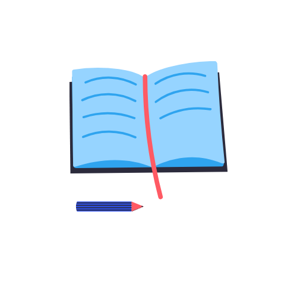
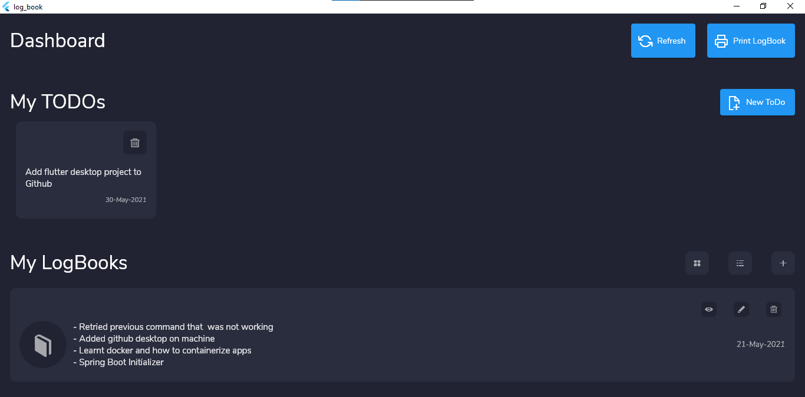
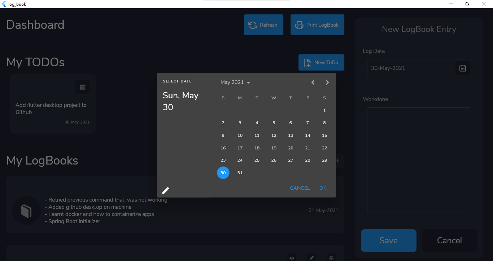
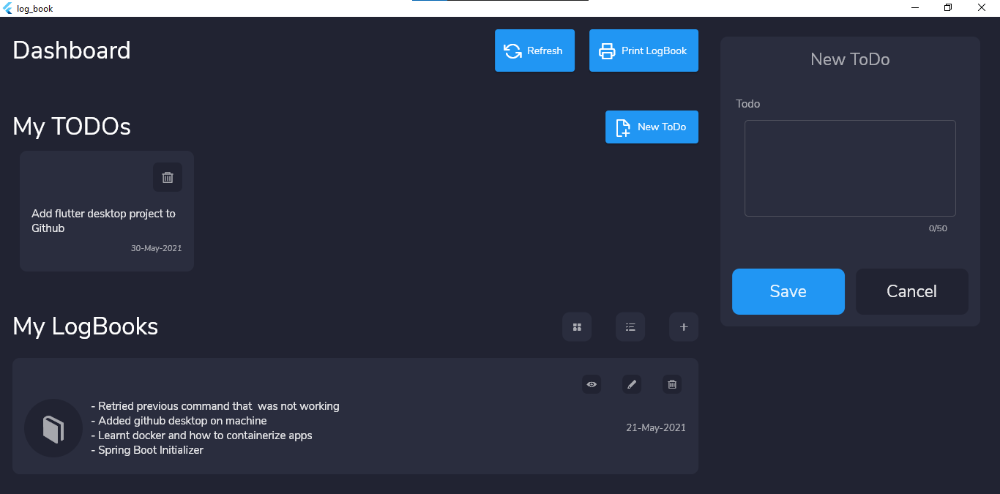

# LogBook Desktop App

an internship log book desktop app

## Table of contents
- [LogBook Desktop App](#logbook-desktop-app)
  - [Table of contents](#table-of-contents)
  - [Features](#features)
  - [Log Book Format](#log-book-format)
  - [Demo](#demo)
  - [Screenshots](#screenshots)
  - [Change Log](#change-log)
  - [Plugins](#plugins)
  - [Appreciation](#appreciation)
  - [Made with Flutter 💙](#made-with-flutter-)
    - [Ico ref](#ico-ref)

## Features
- [x] Create quick ToDos
- [x] Delete ToDos
- [x] Add Log Book entry with date and workdone
- [x] View added logbooks in grid / list view
- [x] Generate and print all logbooks

 

## Log Book Format
| Date       	| Work Done                                                                                                  	| Signature 	|
|------------	|-----------------------------------------------------------------------------------------------------------	|-----------	|
| 10/12/2020 	| - Learnt about Java Spring Boot - Initialized a simple Book App in spring - Learnt about Git as VCS 	|           	|
| 04/01/2021 	| - Helped supervisor to set up windows OS - Learnt about vitualization                                  	|           	|
|            	|                                                                                                           	|           	|

 

## Demo
- watch short demo [video here](assets/screenshots/demo.mp4)

 
 

## Screenshots

## Change Log
- see [change log](CHANGELOG.md)

## Plugins
- [Momentum](https://github.com/xamantra/momentum) (State management)
- [Sembast](https://github.com/tekartik/sembast.dart) (Database)
- [Bitsdojo Window](https://pub.dev/packages/bitsdojo_window) (Window Customization)

## Appreciation
- Star the repo if you like this piece of work
- Want to expand it per your needs, Fork the repo

## Made with Flutter 💙

### Ico ref
ico generated from [crello](https://crello.com/home/)
