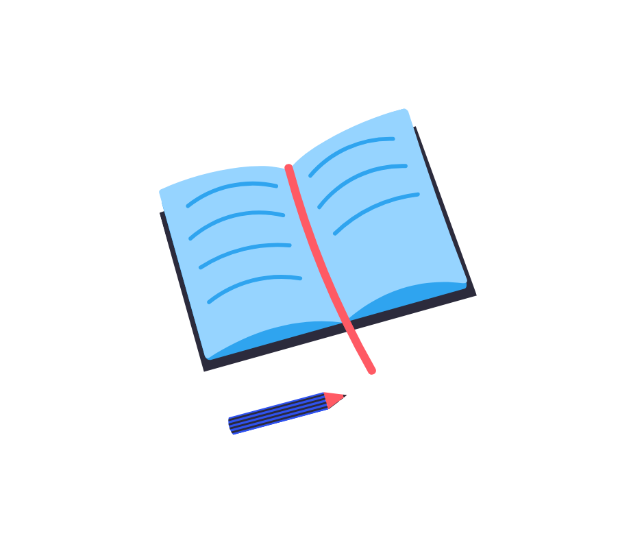

# LogBook Desktop App

an internship log book desktop app

## Features
- [x] Create quick ToDos
- [x] Delete ToDos
- [x] Add Log Book entry with date and workdone
- [x] View added logbooks in grid / list view
- [x] Generate and print all logbooks

## Screenshots

## Plugins
- Momentum (State management)
- Sembast (Database)

- *Developed on &/ for Windows OS

### Made with Flutter 💙

## Appreciation
- Star the repo if you like this piece of work
- Want to expand it per your needs, Fork the repo

## Getting Started

This project is a starting point for a Flutter application.

A few resources to get you started if this is your first Flutter project:

- [Lab: Write your first Flutter app](https://flutter.dev/docs/get-started/codelab)
- [Cookbook: Useful Flutter samples](https://flutter.dev/docs/cookbook)

For help getting started with Flutter, view our
[online documentation](https://flutter.dev/docs), which offers tutorials,
samples, guidance on mobile development, and a full API reference.

### Ico ref
ico generated from [crello](https://crello.com/home/)